# Docker Complete Guide

# 1. Introduction to Docker

Docker is a platform for developing, shipping, and running applications in containers. It enables developers to package applications with all their dependencies into standardized units for software development.

## Key Benefits of Docker:

- Consistent Environment: Same environment across development, testing, and production
- Faster Deployment: Quick application startup and easier scaling
- Resource Efficiency: Lightweight and shares host OS resources
- Version Control and Reuse: Track versions of container images and reuse components

# 2. Virtualization vs Containerization

Understanding the fundamental differences between these two technologies is crucial:

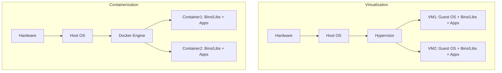

## Key Differences:

| Feature | Virtualization | Containerization |
| --- | --- | --- |
| OS | Requires full OS | Shares host OS |
| Resource Usage | Heavy | Lightweight |
| Boot Time | Minutes | Seconds |
| Isolation | Complete | Process Level |
| Storage | GBs | MBs |
| Performance | Overhead due to hypervisor | Near-native performance |
| Portability | Limited by hardware compatibility | Highly portable across platforms |
| Security | Strong isolation with dedicated kernel | Shared kernel with namespace isolation |
| Resource Allocation | Fixed allocation | Dynamic allocation |

Let's examine these differences in detail:

### Operating System (OS)

Virtual machines require a complete operating system installation for each instance, including the kernel. This means more overhead and resource consumption. Containers, however, share the host OS kernel and only package the necessary binaries and libraries, resulting in much lighter deployments.

### Resource Utilization

VMs consume significant resources as each instance needs dedicated CPU, memory, and storage allocations. Containers are more efficient as they share the host's resources and only use what they need, making them ideal for microservices architecture.

### Boot Time and Performance

While VMs take minutes to boot as they need to initialize an entire OS, containers can start in seconds since they're just spawning processes. Containers also offer near-native performance due to direct host OS interaction, whereas VMs experience some performance overhead due to hypervisor translation.

### Isolation and Security

VMs provide complete isolation as each instance has its own kernel and resources. This makes them more secure for certain use cases. Containers provide process-level isolation through Linux namespaces and cgroups, which is sufficient for many applications but may not be suitable for all security requirements.

### Storage and Portability

VM images are typically several gigabytes in size due to the included OS. Container images are much smaller (usually megabytes) as they only contain application code and dependencies. This makes containers highly portable and easier to distribute across networks.

### Resource Allocation

VMs typically require fixed resource allocation at creation time, while containers can dynamically scale their resource usage based on application needs. This flexibility makes containers more efficient for modern cloud-native applications.

# 3. Docker Architecture

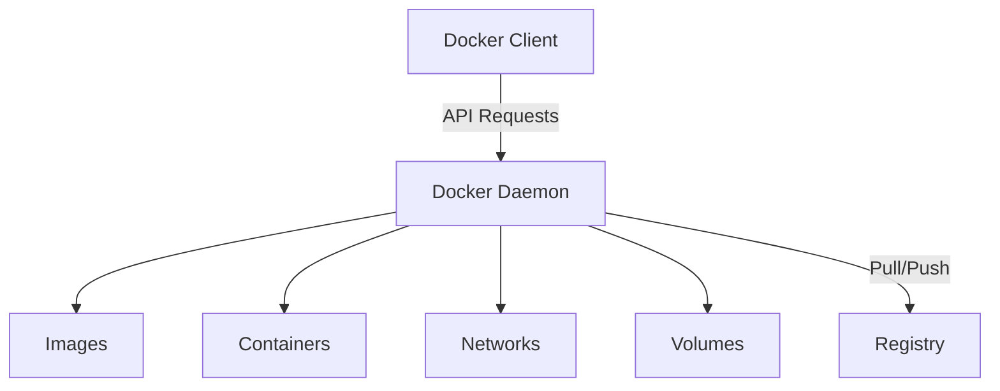

## Components:

- **Docker Client:** Command-line interface for Docker commands
- **Docker Daemon:** Background service managing Docker objects
- **Docker Registry:** Storage for Docker images

# 4. Docker vs Virtual Machines

| Aspect | Docker | Virtual Machines |
| --- | --- | --- |
| Size | MBs | GBs |
| Startup Time | Seconds | Minutes |
| Performance | Near Native | Slower than native |
| Security | Process-level isolation | Complete isolation |

# 5. Installing Docker

- Windows Installation
    
    1. Download Docker Desktop for Windows
    2. Install WSL2 if not already installed
    3. Run the installer
    4. Start Docker Desktop
    
- macOS Installation
    
    1. Download Docker Desktop for Mac
    2. Run the installer
    3. Start Docker from Applications
    
- Linux Installation
    
    1. Update package index:
       sudo apt-get update
    2. Install prerequisites:
       sudo apt-get install apt-transport-https ca-certificates curl software-properties-common
    3. Add Docker's official GPG key
    4. Set up the repository
    5. Install Docker:
       sudo apt-get install docker-ce
    

# 6. Key Docker Components

## Images

Docker images are read-only templates containing instructions for creating containers.

Images are built in layers, where each layer represents a command in the Dockerfile. This layered architecture allows for efficient storage and transfer of images.

### Image Layers

Each layer in a Docker image is:

- Read-only and immutable
- Cached locally to speed up subsequent builds
- Shared between images that use the same layer

### Image Naming and Tagging

Docker images follow a naming convention:

```bash
registry/repository:tag
```

For example: [docker.io/nginx:latest](http://docker.io/nginx:latest)

### Best Practices for Images

- Use official base images when possible
- Minimize the number of layers to reduce image size
- Implement multi-stage builds for smaller production images
- Always specify a tag instead of using 'latest'
- Remove unnecessary files and dependencies

Understanding how images work is crucial for optimizing your Docker workflows and ensuring efficient container deployments.

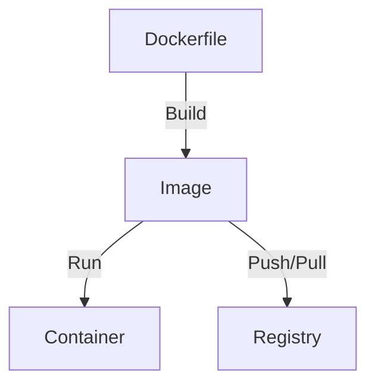

## Containers

Containers are runnable instances of images that can be started, stopped, moved, and deleted.

### Container Fundamentals

A container is a standard unit of software that packages code and all its dependencies together. This ensures that the application runs quickly and reliably across different computing environments.

### Key Container Characteristics

- **Isolation:** Each container runs in isolated user space but shares the host OS kernel
- **Lightweight:** Containers share OS resources, making them more efficient than VMs
- **Portable:** Containers can run consistently across any platform that supports Docker
- **Scalable:** Easy to create, destroy, and distribute across systems

### Container Lifecycle

Containers go through several states during their lifecycle:

- **Created:** Container is created but not started
- **Running:** Container is executing with allocated resources
- **Paused:** Container execution is temporarily suspended
- **Stopped:** Container execution is halted but configuration preserved
- **Deleted:** Container is removed along with its resources

### Container Configuration

Containers can be configured with:

- Resource limits (CPU, memory)
- Network settings and port mappings
- Volume mounts for persistent storage
- Environment variables for application configuration

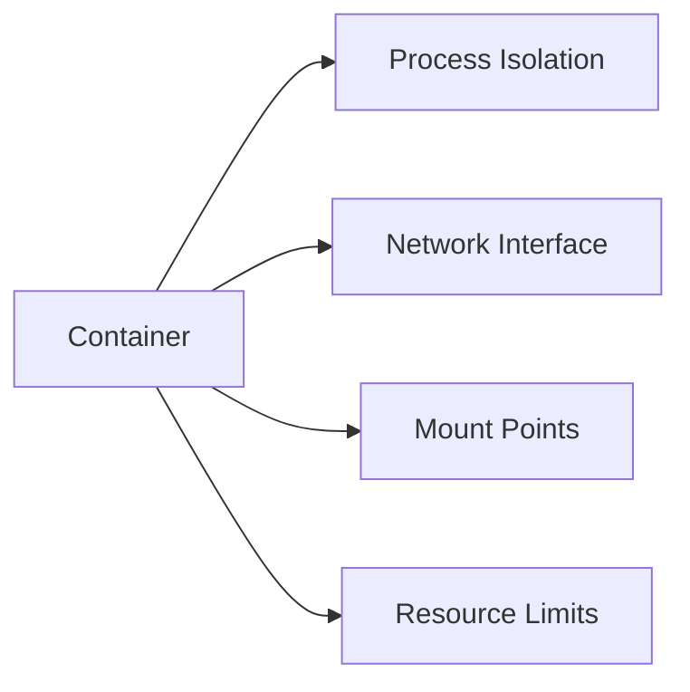

## Volumes

Volumes are the preferred mechanism for persisting data generated by and used by Docker containers.

Key benefits of Docker volumes include:

- Persistent data storage independent of container lifecycle
- Easy data sharing between containers
- Built-in volume drivers for cloud storage integration

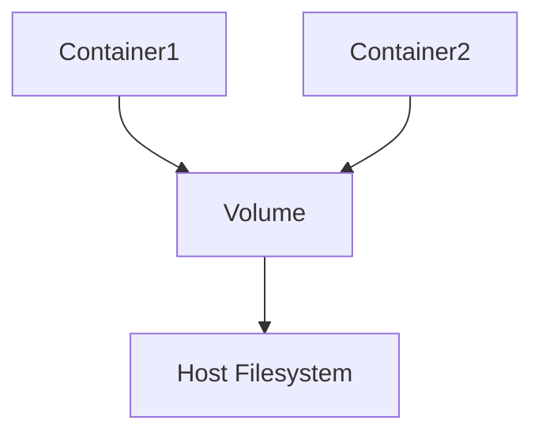

## Networks

Docker networks enable communication between containers and with the outside world.

### Network Types

- **Bridge Network:** Default network type that allows containers to communicate with each other on the same host
- **Host Network:** Removes network isolation between container and host, using host's networking directly
- **Overlay Network:** Enables communication between containers across multiple Docker hosts
- **None Network:** Completely isolates container with no external networking

### Network Features

- **DNS Resolution:** Automatic service discovery between containers
- **Port Mapping:** Expose container ports to host system
- **Load Balancing:** Distribute traffic across multiple containers
- **Network Isolation:** Secure container communication through network segmentation

### Network Security

Docker networks provide several security features:

- Network isolation between container groups
- Built-in encryption for overlay networks
- Access control through network policies
- Port exposure control through explicit publishing

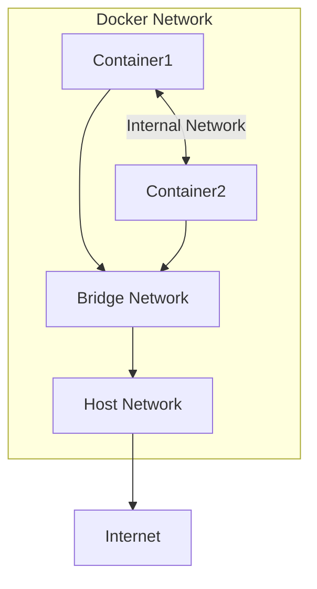

# 7. Docker Images and Containers: In-Depth Guide

## Understanding Docker Images

Docker images are read-only templates used to create containers. They are built in layers, making them efficient and reusable.

```mermaid
graph TB
    subgraph "Image Layers"
        style subgraph fill:#f0f8ff
        A["Base Layer (OS)"] -->|Layer 1| B["System Libraries"]
        B -->|Layer 2| C["Runtime Environment"]
        C -->|Layer 3| D["Application Code"]
        D -->|Layer 4| E["Configuration"]
    end
    style A fill:#ffcccb
    style B fill:#98fb98
    style C fill:#87ceeb
    style D fill:#dda0dd
    style E fill:#f0e68c
```

## Docker Hub and Registry Operations

Docker Hub is the default public registry for Docker images. Understanding how to interact with registries is crucial for container deployment.

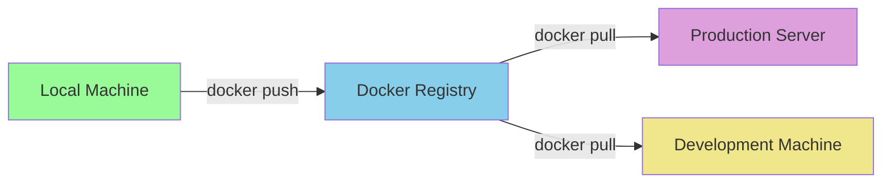

## Container Lifecycle Management

Docker provides comprehensive commands for managing container lifecycle:

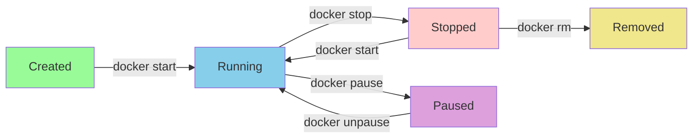

## Dockerfile Instructions Explained

### FROM Instruction

Specifies the base image. Always the first instruction in a Dockerfile.

```
FROM ubuntu:20.04
FROM node:14-alpine
```

### WORKDIR Instruction

Sets the working directory for subsequent instructions. Creates the directory if it doesn't exist.

```
WORKDIR /app
WORKDIR /usr/src/app
```

### COPY and ADD Instructions

Both copy files from source to destination in the container. ADD has additional features like URL support and tar extraction.

```
COPY package.json .
ADD https://example.com/file.tar.gz /tmp/
```

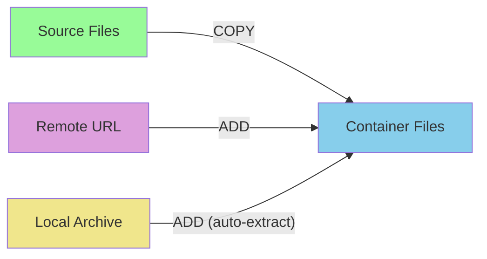

### RUN Instruction

Executes commands during image build. Creates a new layer in the image.

```
RUN apt-get update && apt-get install -y nodejs
RUN npm install
```

### CMD and ENTRYPOINT Instructions

CMD provides defaults for executing container. ENTRYPOINT configures container as executable.

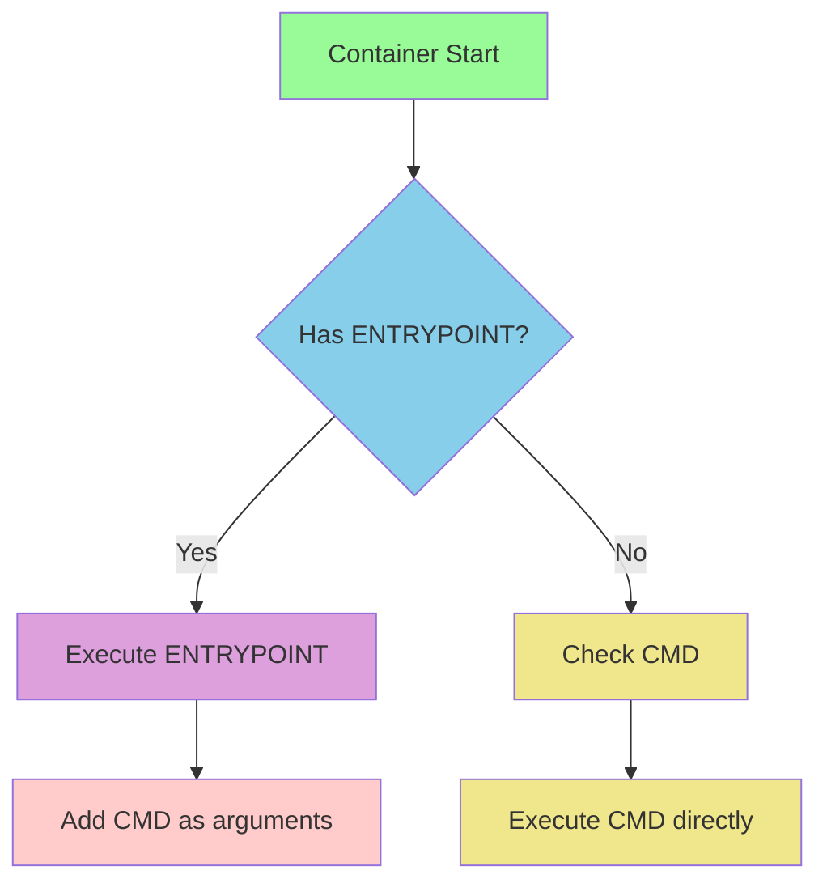

### EXPOSE Instruction

Documents which ports the container listens on at runtime.

```
EXPOSE 80
EXPOSE 3000 8080
```

### ENV Instruction

Sets environment variables in the container. Available during build and runtime.

```
ENV NODE_ENV=production
ENV PORT=3000 DEBUG=true
```

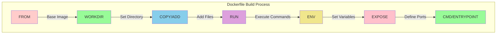

### Best Practices for Dockerfile Instructions

- Use multi-stage builds to reduce final image size
- Chain RUN commands using && to reduce layers
- Keep frequently changing instructions towards the end
- Use .dockerignore to exclude unnecessary files
- Always specify versions in FROM instruction
